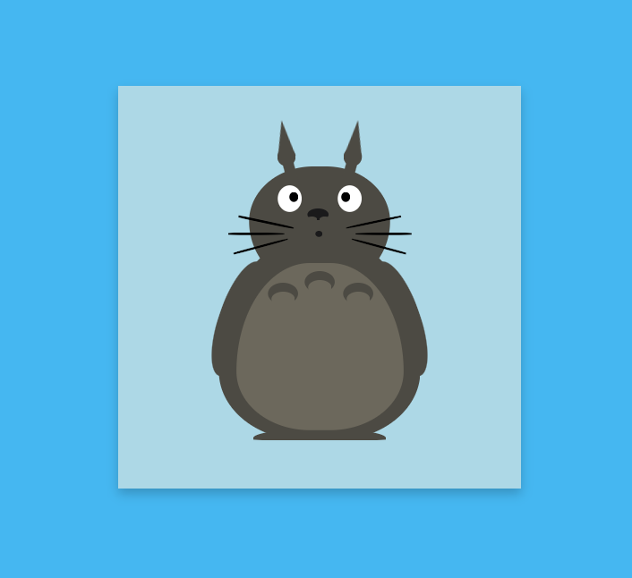

# CSS Project - Second Semester

This project was created during my second semester as part of my coursework. The sibject was to create one figurative trademark and one word trademark

## Collaboration

This project was developed in collaboration with Marco Holzaepfel. We worked together to create and implement the design concepts and CSS styles used in this project.

## Pictures

